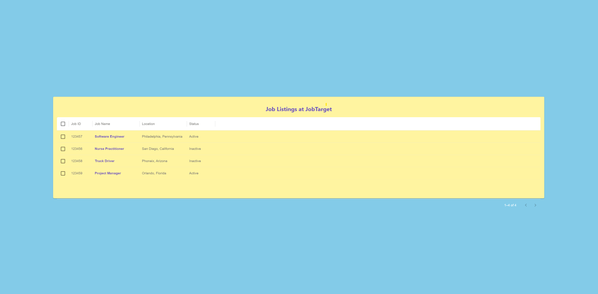

# 🏢 Job Board Application

## Overview
 This is a **full-stack Job Board application** using: **FastAPI** for the backend and **React with Material UI** for the frontend. The backend is connected to **MongoDB**, and the frontend communicates with it via **Axios**.

## Tech Stack
### Backend (FastAPI)
- **FastAPI** for API development
- **MongoDB** for database
- **Motor** for asynchronous MongoDB operations
- **CORS Middleware** for API security
- **Uvicorn** for running the FastAPI server

### Frontend (React + Material UI)
- **React.js** for the UI
- **Material UI** for styling
- **Axios** for API calls
- **React Router** for navigation

---

## 🚀 Features
- Users can view **job listings**, Stored in **MongoDB**.
- Responsive **React frontend** using **Material UI**.
- **Axios** for API communication.

---

### **📌 Project Structure**

```
📁 JobListing/
│── backend/            # FastAPI Backend (Python)
│   ├── __pycache__/    # Python cache files
│   ├── controller.py   # Business Logic Layer
│   ├── instructions.txt # Additional setup instructions
│   ├── jobs.json       # Sample Job Data
│   ├── main.py         # FastAPI API Routes
│   ├── models.py       # MongoDB Models (ODM)
│   ├── routes.py       # API Routes Definition
│── frontend/           # React Frontend (Material UI)
│   ├── joblistingapp/
│   │   ├── public/     # Static assets
│   │   ├── src/
│   │   │   ├── App.css        # Global Styles
│   │   │   ├── App.js         # Main React Component
│   │   │   ├── App.test.js    # Testing setup
│   │   │   ├── JobDetail.js   # Job Details Component
│   │   │   ├── JobList.js     # Job Listings Component
│   │   │   ├── index.css      # Stylesheet for index
│   │   │   ├── index.js       # React Entry File
│   │   │   ├── logo.svg       # Logo Image
│   │   │   ├── reportWebVitals.js # Performance Reporting
│   │   │   ├── setupTests.js  # Test Setup
|   ├── frontendtesting.png       # Frontend image
│   ├── .gitignore       # Git ignore file
│   ├── package-lock.json # Lock file for dependencies
│   ├── package.json     # React Dependencies
│   ├── node_modules/    # Installed dependencies
│── myenv/              # Python Virtual Environment
│── README.md           # Documentation
│── requirements.txt    # Python Dependencies
```

---

## Setup Instructions

## 🔥 **1. Backend Setup (FastAPI + MongoDB)**
### **📌 Prerequisites**
- Install **Python 3.9+**
- Install **MongoDB** (Ensure MongoDB is running)

### **1️⃣ Clone the Repository**
```sh
git clone https://github.com/Solanki-Raja/JobListing.git
cd JobListing
```

### **2️⃣ Backend Setup (FastAPI)**
#### **Install dependencies**
```sh
python -m venv myenv
source env/bin/activate  # On Windows use `env\Scripts\activate`
pip install -r requirements.txt
cd backend
```

#### **Start MongoDB Locally**
Make sure MongoDB is running locally or use **MongoDB Atlas**.

#### **Run FastAPI Server**
```sh
uvicorn main:app --reload
```
FastAPI API will be running at:
```
http://127.0.0.1:8000
```

#### **Test API Endpoints** (Optional)
Use Postman or a browser to test:
- `GET http://127.0.0.1:8000/api/jobs` → Fetch all jobs
- `GET http://127.0.0.1:8000/api/job/{job_id}` → Fetch a job by ID


## 🔥 **2. Frontend Setup (React + Material UI)**
### **1️⃣ Frontend Setup (React + Material UI)**
#### **Install dependencies**
Although dependancies would be install through requirements.txt but if you want to install manually below are the commnands.

```sh
cd frontend/joblistingapp
npm install
npm install @mui/material @emotion/react @emotion/styled
```

#### **Run React Development Server**
```sh
npm start
```
frontend app will be running at:
```
http://localhost:3000
```
Frontend Testing Screenshot



## 🔥 **3.  Making Application Production Ready**

- 1️⃣ **Deploy application to cloud for scalability**
  - As the number of users and request rate increase, we will need to increase resources in terms of compute, routing, and storage. To scale quickly from a few hundred users to millions, it will be wise to move the solution to an **IAC cloud platform** like **AWS, Azure, or Google Cloud**, if we don't want to commit to buying on-prem hardware resources.

- 2️⃣ **Setup Gunicorn as WSGI server**
  - Using **Gunicorn** in production ensures your Python web application can efficiently handle multiple requests simultaneously through its support for multi-processing and concurrency. It also offers reliability with automatic worker recovery and performance optimizations, making it a robust choice for scalable, high-traffic environments. Additionally, it integrates seamlessly with popular web frameworks and reverse proxies like **Nginx**, ensuring your app is secure and well-configured for production.

- 3️⃣ **Use containerization**
  - Use a containerization framework like **Docker** to make the project horizontally scalable.

- 4️⃣ **Use a managed cloud database**
  - Using a managed cloud database like **MongoDB Atlas** will provide **scalability** to storage and **resiliency** against data loss and downtime.

- 5️⃣ **Setup CI/CD pipeline**
  - Using **GitLab/Jenkins** or cloud-integrated CI/CD tools like **AWS CodePipeline**, to release updates with **minimal downtime** and have **automated testing** integrated to make the project more robust and fail-safe.

- 6️⃣ **Monitoring applications**
  - Integrate **Prometheus** or **Datadog** for **logging** and **monitoring** of application performance.

- 7️⃣ **Create Infrastructure as Code scripts**
  - Using **Terraform** or **Cloud Development Kits (CDK)** to **automate** the spin-up and teardown of resources.

---

## Future Enhancements
- ✅ Add Authentication (JWT, OAuth)
- ✅ Implement Role-Based Access Control (RBAC)
- ✅ Enhance UI with better filtering and search options

---
